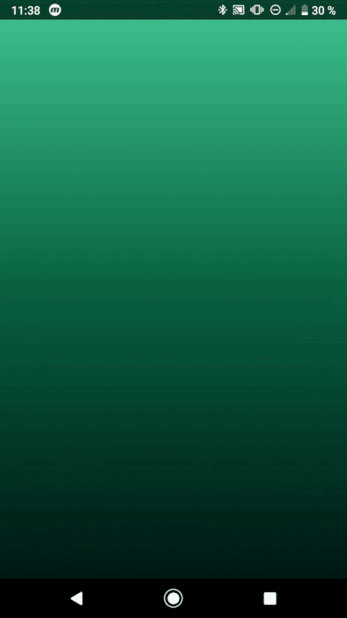
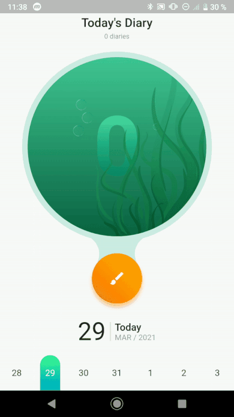

# goldfish_notes_ui_demo

This is demo counter app inspired by this [design on Dribbble](https://dribbble.com/shots/5891868-Goldfish-Notes-App).

## About

My main goal was to implement nice animations. For achieve this I tried to combine various standard Flutter animation widgets, especially [SlideTransition](https://api.flutter.dev/flutter/widgets/SlideTransition-class.html) and [FadeTransition](https://api.flutter.dev/flutter/widgets/FadeTransition-class.html).

I also needed a custom calendar to make it look consistent across the app, so I found this amazing [package](https://pub.dev/packages/table_calendar).

## How it looks

### Splash screen

### Counter

## Resources 
Image - [PNG images](http://pngimg.com/)
